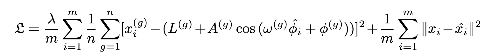

# PENN (DBB2023)
Phase Estimation Neural Network on Gene Expression Data ([PENN](https://www.researchgate.net/publication/372093452_PENN_Phase_Estimation_Neural_Network_on_Gene_Expression_Data)) is a deep learning based method designed for the prediction of unordered gene expression data. 
The architecture of this network is based on the CYCLOPS. However, PENN incorporates the potential periodic oscillation information of the cyclic genes into the objective function to regulate the phase estimation.

PENN's inroduced loss function has two parts. The first part of the equation is the error of fitting observations with the cosine curve using predicted phases considering each gene's geometry. The second part of the loss function is the auto-encoder reconstruction loss.



where L<sup>g</sup> is the average level, A<sup>g</sup> is the amplitude, φ<sup>g</sup> is the phase shift and 2π/ω is the period of the g-th eigen-gene. L<sup>g</sup>, A<sup>g</sup>,φ<sup>g</sup> and ω<sup>g</sup> are learnable variables given some initial values and they will be trained through the network. x<sup>^</sup><sub>i</sub> is the output of the auto-encoder for sample i and x<sup>(g)</sup><sub>i</sub> is the input value for gene g and sample i. φ<sup>^</sup><sub>i</sub> is the predicted phase for sample i. λ is a balancing factor. 

This repository contains a Keras implemented version of the PENN. We have tested our method on Mouse liver [GSE11923](https://www.ncbi.nlm.nih.gov/geo/query/acc.cgi?acc=GSE11923), mouse heart [GES54650](https://www.ncbi.nlm.nih.gov/geo/query/acc.cgi?acc=GSE54650) and human temporal cortex data [GSE131617](https://www.ncbi.nlm.nih.gov/geo/query/acc.cgi?acc=GSE131617). In this repository, we have provided the code on mouse liver data.

## Dataset

The dataset has been saved in csv format where rows are samples and columns represent the genes. On human dataset, then you can find seed genes (known cyclic genes) either directly using the seed genes provided by CYCLOPS or some pre-processing methods to find potential cyclic genes. On mouse dataset, finding seed genes is optional and not necessarily needed based on our experiments. Data is then normalized using z-score normalization. After normalization, PCA is used for dimensionality reduction and finding eigen-genes. 

## How to cite

If you find this repository useful in your work, please consider citing it:

```bibtex
@inproceedings{ansary2023penn,
  title={PENN: Phase Estimation Neural Network on Gene Expression Data},
  author={Ansary Ogholbake, Aram and Cheng, Qiang},
  booktitle={The International Conference on Deep Learning, Big Data and Blockchain},
  pages={59--67},
  year={2023},
  organization={Springer}
}
```
## Contact
If you have any questions or you would like us to provide you with more data, seed genes or any other resources, please reach us through our emails:

Aram Ansary Ogholbale (aram.ansary@uky.edu) and Qiang Cheng (qiang.cheng@uky.edu).
